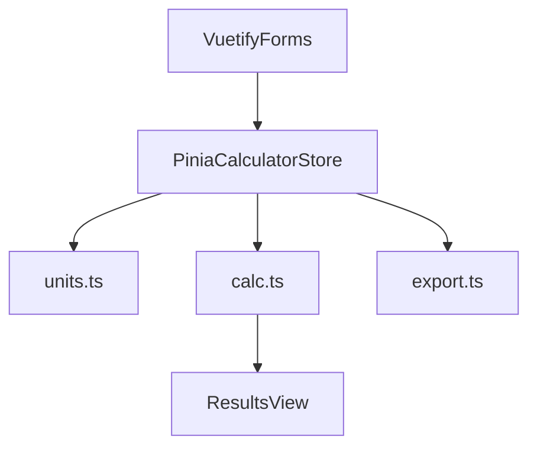

# Battery Lifetime Calculator – MVP Plan

## Zielumfang (MUSS)

- **Batterie-Eingaben**: Kapazität (mAh), Nutzbare Kapazität (%).
- **Phasenmodell**: Standardphasen **Active** (editierbar) + **DeepSleep** (Auto-Restzeit, Strom editierbar), unbegrenzt weitere Phasen.
- **Pro Phase**: Name, Strom (µA/mA/A), Dauer (ms/s/min/h), Modus **A (Dauer+Intervall)** oder **B (Dauer+Häufigkeit)**, globaler Default-Modus für neue Phasen.
- **Berechnung (mAh-basiert)**: mAh/Tag pro Phase, Summe mAh/Tag, Ø-Strom (mA), Laufzeit (Tage/Wochen/Monate).
- **UX**: Live-Update + expliziter **Berechnen**-Button, Validierung (Werte >0) + Warnungen (Dauer>Intervall, aktive Zeit/Tag > 24h).

## Architektur / Datenfluss

- **Single Source of Truth**: Pinia-Store hält Scenario (Batterie + Phasen + UI-Defaults).
- **Rechenpipeline**: Eingaben → Normalisierung (SI/Day) → Validierung/Warnungen → KPIs + per-phase breakdown.

## UI-Struktur (Vuetify)

- [`src/App.vue`](src/App.vue): Shell/Layout (Container, Grid, Header, DE/EN Toggle vorbereitet).
- [`src/components/BatteryForm.vue`](src/components/BatteryForm.vue): mAh, Nutzbar%.
- [`src/components/PhasesEditor.vue`](src/components/PhasesEditor.vue): Liste der Phasen (add/remove), pro Phase Eingabemodus A/B, Einheiten.
- [`src/components/ResultsPanel.vue`](src/components/ResultsPanel.vue): KPI-Kacheln + Warnungen.
- [`src/components/Charts/PhaseShareDonut.vue`](src/components/Charts/PhaseShareDonut.vue): einfacher Donut via CSS `conic-gradient`.
- [`src/components/Charts/CycleTimeline.vue`](src/components/Charts/CycleTimeline.vue): Gantt-ähnlich für einen **wählbaren Referenz-Intervall** (z. B. häufigster Intervall aus Modus-A-Phasen).
- [`src/components/SensitivityBar.vue`](src/components/SensitivityBar.vue): What-if ±10% für Active-Strom.

## Berechnungslogik (mAh/Tag)

- **Einheiten**:
- Strom: µA/mA/A → mA
- Dauer: ms/s/min/h → Stunden
- Intervall: s/min/h → Sekunden
- Häufigkeit: X pro Stunde/Tag/Woche → Events/Tag
- **Per Phase (nicht-DeepSleep)**:
- Modus A: Events/Tag = \(86400 / intervalSeconds\)
- Modus B: Events/Tag = umgerechnet aus Stunde/Tag/Woche
- Verbrauch/Tag = \(I_{mA} * durationHours * eventsPerDay\) = mAh/Tag
- **DeepSleep (Auto-Rest)**:
- AktiveZeit/Tag = Sum(durationSeconds * eventsPerDay) über alle nicht-DeepSleep-Phasen
- DeepSleepZeit/Tag = max(0, 86400 - AktiveZeit/Tag)
- DeepSleepVerbrauch/Tag = \(I_{mA} * (DeepSleepZeit/Tag / 3600)\)
- **Gesamt**:
- Gesamt_mAh/Tag = Summe
- Ø-Strom (mA) = Gesamt_mAh/Tag / 24
- NutzbareKapazität_mAh = capacity_mAh * (usablePercent/100)
- Laufzeit_Tage = NutzbareKapazität_mAh / Gesamt_mAh/Tag
- Ausgabe: Tage, Wochen (= /7), Monate (= /30.44, UI labelt „Monat=30.44 Tage“)

## Validierung & Warnungen

- **Errors (blockierend)**:
- negative/0 Werte (wo sinnvoll), Kapazität<=0, Nutzbar% außerhalb 1–100.
- Dauer<=0.
- Modus A: Intervall<=0.
- Modus B: Häufigkeit<=0.
- **Warnings (nicht blockierend)**:
- Modus A: Dauer > Intervall.
- AktiveZeit/Tag > 24h (DeepSleep wird 0, Modell inkonsistent).
- Optional: Wenn mehrere Modus-A-Phasen exakt selben Intervall haben und Summe ihrer Dauer > Intervall (interpretiert als „gleicher Zyklus“).

## I18n Vorbereitung (DE/EN)

- Leichte Vorbereitung ohne große Abhängigkeiten: zentrale String-Map in [`src/i18n/messages.ts`](src/i18n/messages.ts) und kleiner `useI18nLite()` Helper; später austauschbar gegen `vue-i18n`.

## Export (optional, klein)

- JSON Export der Konfiguration + CSV Export der KPIs (mAh/Tag, I_avg, Laufzeit). Datei-Download via `Blob`.

## Geplante Dateiänderungen

- Vuetify Setup: `package.json`, `src/main.ts`, neuer Plugin-Entry [`src/plugins/vuetify.ts`](src/plugins/vuetify.ts).
- Neue Calculator-Engine: [`src/lib/units.ts`](src/lib/units.ts), [`src/lib/calc.ts`](src/lib/calc.ts), [`src/lib/validation.ts`](src/lib/validation.ts).
- Store: [`src/stores/calculator.ts`](src/stores/calculator.ts) (oder Umbenennung/Erweiterung bestehender Store).
- UI-Komponenten unter `src/components/**`.

## Teststrategie (manuell, schnell)

- Beispielpreset (ESP32 DeepSleep + Wake) als Default-Daten im Store.