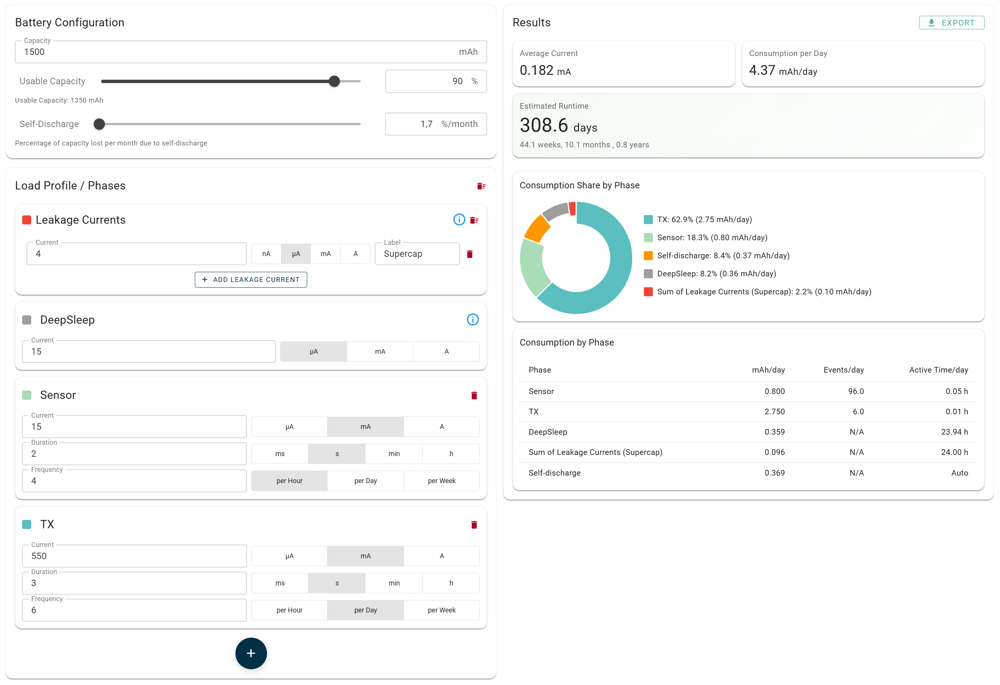

# Battery Lifetime Calculator

Public app: [https://vschroeter.github.io/battery-lifetime-calculator/](https://vschroeter.github.io/battery-lifetime-calculator/)

A small web tool to estimate **battery lifetime of microcontroller / IoT devices** from a realistic load profile (sleep + periodic active phases). It helps you answer questions like:

- How long will my node run on a 1500 mAh cell?
- Which phase dominates my consumption (TX vs sensor vs sleep)?
- What happens if I reduce TX frequency or shorten wake time?



## How it works (concept)

You describe your device as a set of **phases** (e.g. DeepSleep, Sensor read, TX):

- **Current**: per phase, with selectable units (µA / mA / A)
- **Duration + frequency**: e.g. “3 s, 6× per day”
- **Battery settings**: nominal capacity, usable capacity (derating), and optional self‑discharge

The calculator turns this into an **average current** and **consumption per day**, and estimates runtime in days/weeks/months/years. Charts and tables show which phase contributes most.

## How to use the app

1. **Enter the battery capacity** and (optionally) set **usable capacity** and **self-discharge**.
2. **Define phases** for your load profile:
   - Add phases like Sensor, TX, GPS, etc.
   - Set each phase’s current, duration, and frequency.
   - DeepSleep is treated as the remaining time in the day after all active phases.
3. (Optional) Add **leakage currents** (permanent loads) to the total load calculation.
4. Click **Calculate** to refresh results.
5. (Optional) Use **Export** to share or archive a configuration/results snapshot.

## Local development

Requirements:

- Node.js (see `package.json` engines: `^20.19.0 || >=22.12.0`)
- pnpm

Install dependencies:

```sh
pnpm install
```

Start dev server:

```sh
pnpm dev
```

Other useful commands:

```sh
pnpm build
pnpm preview
pnpm lint
```
