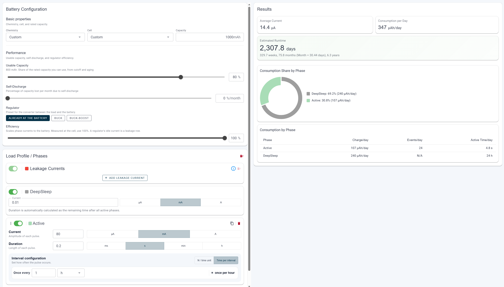

# Battery Lifetime Calculator

Public app: [https://vschroeter.github.io/battery-lifetime-calculator/](https://vschroeter.github.io/battery-lifetime-calculator/)

A small web tool to estimate **battery lifetime of microcontroller / IoT devices** from a realistic load profile (sleep + periodic active phases). It helps you answer questions like:

- How long will my node run on a 1500 mAh cell?
- Which phase dominates my consumption (TX vs sensor vs sleep)?
- What happens if I reduce TX frequency, shorten wake time, or switch a load off?



The interface is in **English or German**. 

## How it works (concept)

You describe the battery and the device load:

- **Battery**: start from a chemistry and a typical cell (Li-SOCl2, Li-MnO2, Li-FeS2, alkaline, Li-ion / Li-Po, LiFePO4, or low-self-discharge NiMH), or enter a custom capacity. Usable capacity and self-discharge follow the chemistry and can be overridden.
- **Regulator efficiency**: scales phase currents onto the battery side. Use 100% when the currents were already measured at the cell. A regulator’s idle current is a leakage row.
- **Phases** (DeepSleep, sensor read, TX, and so on): current (µA / mA / A), pulse duration, and duty. Duty is either a rate (for example 6× per day) or an interval (once every 4 hours).
- **Include or exclude**: any phase or leakage source can be left out of the calculation so you can see its effect on lifetime.
- **Leakage**: named permanent loads, 24 hours a day, listed under one total.

The calculator turns this into an **average current** and **consumption per day**, and estimates runtime in days, weeks, and months. 
Charts and the phase table show which load contributes most. 
DeepSleep fills the time left in the day after every included active phase. 


The address bar holds the open configuration, so a link is the profile. 
JSON export uses the same configuration in a file.

## How to use the app

1. **Set the battery.** Choose a chemistry and cell, or type the capacity yourself. Adjust **usable capacity**, **self-discharge**, and **regulator efficiency**.
2. **Define phases** for the load profile:
   - Add, duplicate, reorder, or rename phases such as Sensor, TX, or GPS.
   - Set each phase’s current, pulse duration, and duty as a rate or an interval.
   - Switch a phase off to leave it out of the lifetime.
   - DeepSleep duration is the remaining time after all included active phases. 
3. **Add leakage currents** for permanent loads. Each source has its own label and can be switched off. Results list them under one leakage total.
4. **Share or save** the profile:
   - The address bar updates as you edit. **Copy link** puts that URL on the clipboard.
   - **Reset to example** clears the link and restores the built-in example.
   - **Export** saves the configuration as `.json`, or the current results as `.csv` when a lifetime can be calculated.
   - **Import** replaces the open battery, phases, and leakage currents from a previously exported `.json` file.
5. Switch **language** (EN / DE) and **theme** (system, light, or dark) from the header.

## Local development

Requirements:

- Node.js (see `package.json` engines: `^20.19.0 || >=22.12.0`)
- pnpm

Install dependencies:

```sh
pnpm install
```

Start dev server:

```sh
pnpm dev
```

Other useful commands:

```sh
pnpm build
pnpm preview
pnpm lint
pnpm test
```
